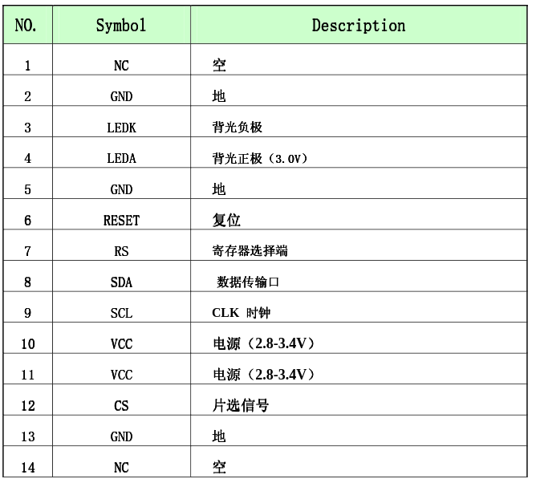
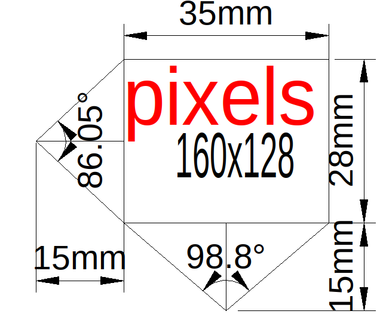

<http://uk.rs-online.com/web/p/oled-displays/0554314/>

<http://uk.farnell.com/midas/mct0144c6w128128pml/display-tft-lcd-1-44-transmissive/dp/2606862>

# lcd

[pickedlcd](https://www.adafruit.com/product/618)

## pinout

lcd pin number | name  | used | colour
-------------- | ----- | ---- | ------
1              | NC    | no   | na
2              | gnd   | no   | purple
3              | ledk  | no   | na
4              | leda  | no   | na
5              | gnd   | no   | pink
6              | reset | no   | blue
7              | rs/dc | no   | grey
8              | sda   | yes  | yellow
9              | scl   | yes  | green
10             | vcc   | no   | orange
11             | vcc   | yes  | na
12             | cs    | no   | white
13             | gnd   | yes  | black
14             | NC    | no   | na

# lcd maths

$$ { \frac {128} {86.05}} = 1.48 \text{ vertical degrees per pixel}$$

$$ { \frac {160} {98.8}} = 1.62 \text{ vertical degrees per pixel}$$
