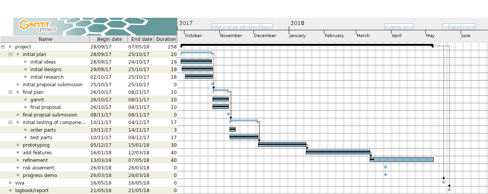
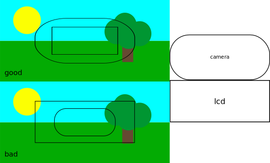
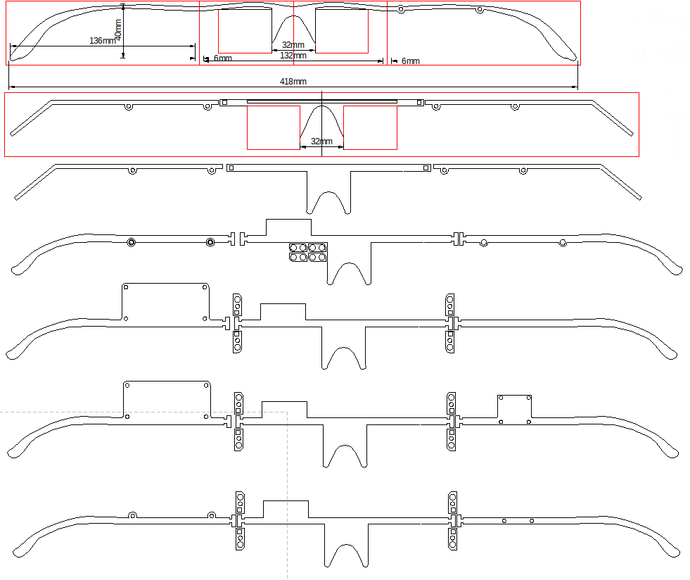

# **Final Year Project**


By David Joseph Hawkins

A report submitted to the University of Plymouth in partial fulfilment for the degree of BEng(Hons) Electrical and Electronic Engineering.

# Stage Criteria

This is the criteria I would like to meet, to feel as though I have created a successful project.

| Stage | Name                        | Description                                        |
| ----- | --------------------------- | -------------------------------------------------- |
| 1     | Smart shades                | Make a set of smart sunglasses                     |
| 2     | Auto smart shades           | Add LDR to control the opacity                     |
| 3     | Auto smart point shades     | Add camera to make darks points over bright points |
| 4     | Controllable smart shades   | Add options to swap between modes                  |
| 5     | Driving/safety improvements | Auto react to headlights etc.                      |

## Inspiration

I saw this video[^1] about this case[^2] and got the idea for reactive sunglasses while I was researching to see if this had already been done I found theses glasses[^3].

This product starts down the path I would like to take but are binary and I would like different levels of tinting and active shading. To achieve this I will need to use a LCD panel with pixels instead of a single panel. Also one of this products main unique selling points is the sub 0.1 second light to dark time[^4] which ideally I will surpass. The other advantage have will be cost since theses cost $299 and I'm aiming to make for under £100[^5].

## Plan

The products above, along with Paul Davey's lectures last year inspired my idea.

The plan is to use two LCD's with the backlight removed, to create dimmable panels in front of the users eyes. Then eventually I will add a camera to make point control which will block bright spots such as projectors and the sun, and dim them to reduce squinting.

### Potential issues

-   IO speed, depending on the solutions used I could end up running into IO speed bottle necks affect frame rate
-   frame rate for the active points would need to be fairly high to stop nauseating effect.
-   camera distortion, I would like to use a camera with little to no distortion this would make image processing easier.
-   Field of view, having a similar FoV would be useful since a camera with smaller FoV would end up wasting the edge of the LCD.
-   Aspect ratio, mismatch of aspect ratios with out use of accelerometers for predictive tracking could cause issues

### Timeline



# Final Mock-up


So, once I have removed the backlight from the LCD's I can mount them in a frame. I can then begin to control the contrast/pixel density to make them dim. I will then add an LDR to automate the brightness selection, this will remove the manual adjust however I will leave the buttons to set the levels.

Next I will add a camera to the system so that the system can detect bright points, hence make a matching point darker on the lens. I will then use the buttons to make it so that you can swap between the different modes. The final additional feature I would like to add is some intelligence on the camera side to ignore certain circumstances such as car tail/headlights.

# Report

## Compute

### VHDL/FPGA(de0nano) vs. arm(stm32 vs. RPI)

For the compute unit the main options I have are arm or FPGA. Theoretically the FPGA will have higher parallel thought put for the camera to LCD interface. Although arm will have image processing libraries which will expedite the prototyping process. The other main advantage with arm is the reduced cost.

| component | quantity | price(£)       | component type | chosen |
| --------- | -------- | -------------- | -------------- | ------ |
| pi zero w | 1        | 9.60           | compute        | yes    |
| pi 3      | 1        | 35             | compute        | no     |
| stm32     | 1        | 18.11          | compute        | no     |
| de0nano   | 1        | 67.16 to 84.46 | compute        | no     |

I'm leaning towards the arm side since the camera will likely be 30-60 fps. I believe that an arm  chip will be quick enough. Also it will have better support for interfacing the camera and LCD, the STM boards have analogue IO for the LDR and contrast for the LCD

After talking to my supervisor and lab tech they both recommended the raspberry pi as the platform. This recommendation is because of the price point of the zero w and the zero cam being so low and the large product support for the increased range of screens possible. The only issue with this will be the fact the pi doesn't have analogue IO so the dimming of the LCD will be harder but this should be easily worked around.

## Camera

| component      | quantity | price(£)        | component type | chosen |
| -------------- | -------- | --------------- | -------------- | ------ |
| pi zero camera | 1        | 15              | camera         | yes    |
| pi camera      | 1        | 24              | camera         | no     |
| ov7670         | 1        | 5 to 10         | camera         | no     |
| ov7720         | 1        | .50 from ps eye | camera         | no     |

The options for the camera were good but I picked the pi zero camera, since it had the best compromise between cost and libraries[^6].

## LCD

I will be using LCD's to reduce the amount of light reaching the users eyes.

| component                  | quantity | price(£)       | component type | chosen |
| -------------------------- | -------- | -------------- | -------------- | ------ |
| MCT0144C6W128128PML        | 2        | 7.57           | lens           | no     |
| DD-12864YO-3A              | 2        | 16.12          | lens           | no     |
| AF 1.8" TFT ST7735R driver | 2        | 10             | lens           | yes    |

The AF 1.8" TFT ST7735R is going to be the best option since its the best size for the lenses. Also there is drivers[^7] available for the raspberry pi.

### Theory


In this diagram from Paul Davey's lecture[^8] on LCD's last year, you can see the inner working of an individual pixel.

This works like so;

1.  Light enters the panel through the rear polarizer. The light becomes vertically polarized.
2.  The polarized light then passes through the transparent backplane electrode.
3.  As the polarized light passes through the Liquid crystal fluid it gets twisted into the horizontal plane.
4.  The polarized light passes through the transparent pixel electrode.
5.  Because the light is polarized in the horizontal plane, it passes through the front horizontal polarizer.

I will be using this effect to reduce the amount of light reaching the users eyes.

### Wiring

| Function | Colour | Pi pins chip side | Pi pin | Colour  | Function |
| -------- | ------ | ----------------- | ------ | ------- | -------- |
| vcc      | Orange | 17                | 18     | Grey    | rs       |
| sda      | Yellow | 19                | 20     | Black/P | gnd      |
| N/A      | nc     | 21                | 22     | Blue    | reset    |
| scl      | Green  | 23                | 24     | White   | cs       |

### Testing

I connected the LCD and displayed some random size and location spots of different opacity on the screen.

[random point video](log/IMG_1188.TRIM.MOV)

After this I set the entire screen to one tint, then changed it when I did this I could the the update "wipe" across the screen.

This will cause issues since I am already at the max spi interface speed

## FOV



Field of view(FoV) is the area that you can can see this is normally measured in degrees. This means for simple mapping I need the FoV of the camera and LCD to be the same the other issues would be;

aspect ratio


distortion


### LCD


160x128 pixels

98.8 degrees horizontal, 86.05 degrees vertical field of view

$$ { \frac {128} {86.05}} = 1.48 \text{ vertical pixels per degree}$$

$$ { \frac {160} {98.8}} = 1.62 \text{ horizontal pixels per degree}$$

### Camera

2592x1944 pixels

53.50 degrees horizontal, 41.41 degrees vertical field of view

$$ { \frac {1944} {41.41}} = 46.95 \text{ vertical pixels per degree}$$

$$ { \frac {160} {98.8}} = 48.45 \text{ vertical pixels per degree}$$

So, this will cause issues since the dot placed on the LCD will end up in the wrong place without scaling.

## Frame

I decided to laser cut the frame since this would be more cost and time effective. Also glasses frames tend to be fairly 2-dimensional. In the following image you can see the design iterations.



Initially my idea was to heat the acrylic and bend at the red line, meaning that you wouldn't be able to fold them.

The next idea I had was another fixed design, but with a simpler shape. I decided to go with this idea rather than the former so this was the first iteration that actually got cut. I found that the lens was going to be too close to the eye and the ribbon cable from the lens was going to dig in to the brow of your nose. This was solved in the third iteration by making the increasing distance between the top of the frame and the top of the nose support. This forced the user to wear the glasses further down their nose.

After this I designed a hinging mechanism and readded the curves to make the glasses more comfortable. I also added a mounting bracket for the camera. This was the frame I cut and used for most of the prototyping phase of the project.

For the next two designs I was contemplating adding a backing plate to the pi mount and also adding a mount for the capacitive touch sensor. This design was never cut since the pi 0 needs clearance for the solder of the pin headers. Also the backing might have added too much weight. I furthered the design of the hinge by squaring off one end to make it more ridged and adding a hole to hold it together.

## Blob Detection

My initial idea for blob detection was to import the grey scale image as a matrix of values. Then to iterate over it, looking for a difference in values or checking against a threshold value. However, I struggled getting the image in as a matrix and even using an example matrix because the code wasn't running very quickly or reliably.

I tried to install opencv to do the image processing but the install failed. After I spoke to my supervisor he confirmed my suspicion that opencv was too overpowered for my project.

So I did some more research around low power blob detection in python and found Skimage which has a function for Determinant of Hessian(DoH) blob detection. This was lightweight, meaning it should be quick enough. The only issue I had then was getting the image from the camera into the right format. Skimage has a built in numpy array converter which was fortunate since the DoH blob detection needs a numpy array to function.

With this working I passed the program an image from the camera and saved the image with a circle around the blob.


I then connected the LCD and got blob detection working with that.


## Telegram

Then I started to convert the shades.py (the file that controls the LCD and camera) and telegrambot.py (the script that enables remote control via a chat client bot). This involved more work than I had initially anticipated since passing variables around wasn't as easy as I had hoped.

I decided to use telegram to add remote control, so that you could adjust the colour of the tint [remote control](https://t.me/smartsheadsfypbot).

### Commands

| Command     | Parameters                  | Description                    |
| ----------- | --------------------------- | ------------------------------ |
| help        | N/A                         | Show the help menu.            |
| pickcolour  | Pick from list of tints     | Preset tints/colours.          |
| pickmode    | Pick from list of modes     | Change current mode.           |
| tint        | Percentage                  | Sets the tint of the lenses.   |
| image       | N/A                         | Shows you the current image.   |
| up          | N/A                         | See if the bot is up.          |
| temp        | N/A                         | See the CPU temperature.       |
| start       | N/A                         | Starts shades.                 |
| stop        | N/A                         | Stop shades.                   |
| exit        | Admin only                  | Exit shades.                   |
| reboot      | Admin only                  | Reboot shades.                 |
| halt        | Admin only                  | Shutdown shades.               |
| uprecords   | N/A                         | See up time.                   |
| debug       | N/A                         | Toggles debug.                 |
| buttons     | Admin only                  | Toggles buttons.               |
| colourset   | fore/back@0/255,0/255,0/255 | Sets the colour of the lenses. |
| allowallids | Admin only                  | Toggles if admin ID is needed. |

## Capacitive Touch Sensor

After I had all of the system working I bought a 5 button capacitive touch sensor. I then started adding that into the code, so that I would be able to control the glasses without having to have it connected to the internet.

### Wiring

| Function | Colour | Pi pins chip side | Pi pin | Colour | Function |
| -------- | ------ | ----------------- | ------ | ------ | -------- |
| 3.3v     | nc     | 1                 | 2      | nc     | 5v       |
| Button 1 | Orange | 3                 | 4      | Red    | 5v       |
| Button 2 | Yellow | 5                 | 6      | Black  | gnd      |
| Button 3 | Green  | 7                 | 8      | Blues  | Button 4 |
| gnd      | nc     | 9                 | 10     | Purple | Button 5 |

### Buttons

| Button | Colour | Pressed      | Held                |
| ------ | ------ | ------------ | ------------------- |
| 1      | Orange | Scroll tints | Reset tint to clear |
| 2      | Yellow | Scroll modes | Reset to manual     |
| 3      | Green  | Debug        | Turn off            |
| 4      | Blue   | Stop         | Start               |
| 5      | Purple | N/A          | Exit                |

For the final design I only used three buttons since the frame was beginning to get a bit cluttered with wires and boards.


I also decided that I would keep all the buttons on one side of the frame, since the capacitive touch sensitivity is a bit to high and I cant change it on this board. This means I'm less likely to have accidental readings from touching the wire if I can keep the wires short.

### Capacitive Touch Control

[Mode change](log/capmode.MOV)
[Tint change](log/tint.MOV)
[Debug toggle](log/debug.MOV)

## Budget

| name                                                                                                                            | price | guantity | total |
| ------------------------------------------------------------------------------------------------------------------------------- | ----- | -------- | ----- |
| [pi0w](https://thepihut.com/collections/raspberry-pi/products/raspberry-pi-zero-w)                                              | 9.60  | 1        | 9.60  |
| [lcd](https://thepihut.com/collections/lcds-displays/products/adafruit-1-8-spi-tft-display-160x128-18-bit-color-st7735r-driver) | 10    | 2        | 20    |
| [pi0 camera](https://thepihut.com/collections/raspberry-pi-camera/products/zerocam-camera-for-raspberry-pi-zero)                | 15    | 1        | 15    |
| [pi0 pibow](http://cpc.farnell.com/pimoroni/pim258/pibow-zero-w-case/dp/SC14550?st=pibow%20cases)                               | 4.19  | 1        | 4.19  |
| [pi0 metal case](http://cpc.farnell.com/kksb/110221b/metal-case-for-raspberry-pi-zero/dp/SC14486)                               | 3.99  | 1        | 3.99  |
| [hdmi to dvi-d](http://cpc.farnell.com/pro-signal/psg04003/lead-hdmi-m-dvi-24-1-m-1m/dp/AV25309?st=hdmi%20to%20dvi)             | 2.87  | 1        | 2.87  |
| [usb ampmeter](https://www.rapidonline.com/voltcraft-pm-37-digital-usb-power-meter-64-2822)                                     | 7.26  | 1        | 7.26  |
| [capacitve sensor](https://www.rapidonline.com/adafruit-1362-standalone-5-pad-capacitive-touch-sensor-breakout-73-5337)         | 7.48  | 1        | 7.48  |
| veroboard                                                                                                                       | 3.60  | 1/4      | .90   |
| 64GB Class 10 MicroSDXC UHS-1 Memory Card & SD Adaptor                                                                          | 23.95 | 1        | 23.95 |
| total                                                                                                                           |       |          | 94.25 |

# Conclusion

## Criteria Met

-   [x] Make a set of smart sunglasses.
-   [x] Add automatic of control the opacity.
-   [x] Add camera to make dark points over bright points.
-   [x] Add options to swap between modes.
-   [ ] Auto react to headlight/safety improvements.

I met all of my stage criteria, except the reacting to headlights. Which I decided wasn't a good idea, since this could interfere with the drivers sight, so I will leave that mode out. I added other safety features like resetting when you hold the mode button. Except for a catastrophic error, the system is fail safe not deadly meaning it clears the LCD before exiting.

## Existing market

| component  | price |
| ---------- | ----- |
| pi 0 W     | 9.60  |
| cap sensor | 0.74  |
| LCD        | 20    |
| camera     | 15    |
| total      | 45.34 |

This is considerably less than the existing market, so even with adding the fame and battery it will be cheaper.

Although I have a lower refresh rate at the moment, I believe with a change of panel I will be able to run quicker.

## Technology readiness level

I believe my project has meet at least technology readiness level 4, even pushing some level 5 criteria as defined by the European Commission[^9].

| Level  | Definition                                                                                                                         |
| ------ | ---------------------------------------------------------------------------------------------------------------------------------- |
| TRL 1. | Basic principles observed.                                                                                                         |
| TRL 2. | Technology concept formulated.                                                                                                     |
| TRL 3. | Experimental proof of concept.                                                                                                     |
| TRL 4. | Technology validated in lab.                                                                                                       |
| TRL 5. | Technology validated in relevant environment (industrially relevant environment in the case of key enabling technologies).         |
| TRL 6. | Technology demonstrated in relevant environment (industrially relevant environment in the case of key enabling technologies).      |
| TRL 7. | System prototype demonstration in operational environment.                                                                         |
| TRL 8. | System complete and qualified.                                                                                                     |
| TRL 9. | Actual system proven in operational environment (competitive manufacturing in the case of key enabling technologies; or in space). |

The European Association of Research and Technology Organisations (EARTO) has a slightly more relevant scale of TRL[^10].


I still believe I'm level 4, with aspects of level 5 according to this scale.

# Future Development

My setup is mostly a proof of concept. For a full prototype/production model, I would use a chip with high IO rates like a DSLR image processing chip, with a low quality and high frame rate camera with a bare LCD.

Because of the image processing chip I would be able to increase the communication speed, since the IO is the limiting factor on the current setup.

The biggest IO limit at the moment is the LCD, this is because the only reasonably priced LCD at this size that I could find use an SPI communication link. Also the LCD driver chip is fairly slow using this link.

The other main issue is the fact this system assumes your eyes are always directly behind the LCD. So, for a fully fledged system I would need to add some form of simple eye tracking to compensate for this.

While talking to other students on the course about my project, one individual mentioned research which could add dynamic prescription[^11]. I thought this would be a good addition to my project as the glasses would be truly dynamic.

**<>** By David Joseph Hawkins using **Atom** and **GitHub**

# Appendix

## Coding languages


## Code

### telegrambot.py

```python
"""Telegram control file."""
import os
import subprocess
from functools import wraps
from random import choice, randint
from time import strftime

from shades import (buttonstoggle, debugset, getiso, modeset, runningstateget,
                    runningstateset, sandd, tintBackset, tintShadeset)
from telegram import InlineKeyboardButton, InlineKeyboardMarkup, ParseMode
from telegram.ext import (CallbackQueryHandler, CommandHandler, Filters,
                          MessageHandler, Updater)

# program variables
test_box_api_key = []
test_box = 0
user = False
admins = []
allowAll = True
jokelist = []

# retrive telegram keys
try:
    f = open('telegramkeys.txt', 'r')
    test_box_api_key.append(f.readline().split('\n')[0])
    admins.append(int(f.readline().split('\n')[0]))
    f.close()
except IOError:
    print 'telgram import fail'
    exit()


# retrive jokes
try:
    f = open('jokes.txt', 'r')
    for line in f:
        jokelist.append(line)
    f.close()
except IOError:
    jokelist = ['joke import failed']
    print jokelist[0]


# Create the EventHandler and  it your bot's token.
updater = Updater(test_box_api_key[test_box])
jbq = updater.job_queue


def restricted1(func):
    """Add re-stricter for access."""
    @wraps(func)
    def wrapped(bot, update, *args, **kwargs):
        user_id = update.effective_user.id  # get user id
        if allowAll or user_id in admins:  # if in open mode or admin id
            return func(bot, update, *args, **kwargs)  # run function
        update.message.reply_text(
            "Access denied for {}.Ask [Jo](tg://user?id={}) for access.".
            format(user_id, admins[0]),
            parse_mode=ParseMode.MARKDOWN
        )  # else echo access denied back to user
        return 'error'

    return wrapped


def restricted2(func):
    """Add re-stricter for admin only access."""
    @wraps(func)
    def wrapped(bot, update, *args, **kwargs):
        user_id = update.effective_user.id  # get user id
        if user_id in admins:  # if  admin id
            return func(bot, update, *args, **kwargs)  # run function
        update.message.reply_text(
            "Access denied for {}.Ask [Jo](tg://user?id={}) for access.".
            format(user_id, admins[0]),
            parse_mode=ParseMode.MARKDOWN
        )  # else echo access denied back to user
        return 'error'

    return wrapped


def time():
    """Return time in formated string."""
    return str(strftime('%d/%m/%Y %H:%M:%S'))


@restricted2
def spam(bot, update, args):
    """Repetitive messages for debug."""
    if int(args[0]) == 0:  # if interval = 0
        jbq.run_once(
            sendMessage, 0, context=[int(args[1]),
                                     args[2]])  # initiate job to reply
    else:  # for reppetive jobs
        jbq.run_repeating(
            sendMessage,
            interval=int(args[0]),
            first=0,
            context=[int(args[1]), args[2]])  # initiate job to repeat


@restricted2
def halt(bot, update):
    """Turn off glasses."""
    update.message.reply_text(
        'Halting at {}'
        .format(time()))  # echo that command was received
    os.system('sudo halt')  # send shutdown command


@restricted2
def reboot(bot, update):
    """Reboot glasses."""
    update.message.reply_text(
        'Rebooting at {}'
        .format(time()))  # echo that command was received
    os.system('sudo reboot')  # send reboot command


@restricted2
def allowallids(bot, update):
    """Toggle restriction level."""
    global allowAll  # pull allowAll in so function can edit

    if allowAll:  # toggle
        allowAll = False
        update.message.reply_text('allowing restricted ids.')
    else:
        allowAll = True
        update.message.reply_text('allowing all ids.')


@restricted2
def exit(bot, update, args):
    """Exit the program cleanly."""
    if len(args) >= 1:
        f = open('run.txt', 'w+')  # open file
        f.write('no')
        f.close()  # close file
    runningstateset(2)  # set sate to exit
    update.message.reply_text('Exiting at {}'
                              .format(time()))  # echo exiting back to user


@restricted2
def buttons(bot, update):
    """Toggle if the buttons are enabled."""
    buttonstoggle()
    update.message.reply_text('Toggled buttons.')  # echo toggled back to user


@restricted2
def addwifi(bot, update, args):
    """Add WiFi network."""
    ssid = args[0]
    psk = args[1]
    f = open('/etc/wpa_supplicant/wpa_supplicant.conf', 'a')  # open file
    f.write('\nnetwork={\n        ssid="')  # format and store network
    f.write(ssid)
    f.write('"\n        psk="')
    f.write(psk)
    f.write('"\n}\n')
    f.close()  # close file
    update.message.reply_text(
        'added {} to wifi'.format(ssid))  # echo added WiFi back to user


@restricted1
def image(bot, update):
    """Send most recent image from camera."""
    bot.send_photo(
        chat_id=update.message.chat_id, photo=open('image1.jpg',
                                                   'rb'))  # send image


@restricted1
def start(bot, update):
    """Start the glasses cleanly."""
    f = open('users.txt', 'a')  # currently debugging by logging new users
    f.write('{}\n\r'.format(update.message.from_user))
    f.close()
    runningstateset(1)  # set state to running
    update.message.reply_text('started')  # echo started back to user


@restricted1
def stop(bot, update):
    """Stop/pause glasses."""
    runningstateset(0)  # set running state to stopped
    update.message.reply_text('stopped')  # echo stopped back to user


@restricted1
def mode(bot, update, args):
    """Manually change the mode."""
    modeset(int(args[0]))  # set mode
    update.message.reply_text('mode set to {}'.format(
        args[0]))  # echo mode back to user


@restricted1
def colourset(bot, update, args):
    """Set the colour of the lenses."""
    update.message.reply_text(colorSplit(
        args[0]))  # colour information to handler


@restricted1
def autoback(bot, update):
    """Calculate the background tint in manual mode."""
    usrin = getiso()  # get ambient light level
    usrin = 'back@{},{},{}'.format(
        int(usrin), int(usrin),
        int(usrin))  # format string to be passed to handler
    update.message.reply_text(colorSplit(usrin))  # string to handler


@restricted1
def tint(bot, update, args):
    """Set background tint percentage."""
    usrin = 100 - int(args[0])  # invert percentage
    usrin = 'back@{},{},{}'.format(
        int(usrin * 2.56), int(usrin * 2.56),
        int(usrin * 2.56))  # format string to be passed to handler
    update.message.reply_text(colorSplit(usrin))  # string to handler


@restricted1
def debug(bot, update):
    """Toggle command line debug."""
    debugset()  # toggle command line debug
    update.message.reply_text(
        'debug toggled')  # echo that the debug has been toggled back to user


def uprecords(bot, update):
    """Run the uprecords command and echo results."""
    p = subprocess.Popen(
        ['uprecords', '-a'], stdout=subprocess.PIPE, stderr=subprocess.PIPE
    )  # open subprocess in thread and pipe back results
    out = p.communicate()  # collect results
    update.message.reply_text(out[0])  # echo results


def temp(bot, update):
    """Get cpu temperature."""
    temp = int(open('/sys/class/thermal/thermal_zone0/temp').read()) / 1000.0
    update.message.reply_text('CPU temperature is:{}'.format(temp))


def joke(bot, update):
    """Send a joke."""
    update.message.reply_text(choice(jokelist))  # pick random joke and send


def meme(bot, update):
    """Send a meme."""
    memeid = randint(1, 17)  # pick random image
    bot.send_photo(
        chat_id=update.message.chat_id,
        photo=open('memes/{}.jpg'.format(memeid), 'rb'))  # send image


def help(bot, update):
    """Display help menu."""
    update.message.reply_text(
        'help im stuck in a box \n\r' +
        '/pickcolour - pick from list of tints\n\r' +
        '/pickmode- pick from list of modes\n\r' +
        '/tint percentage\n\r' + '/colourset fore-back@0-255,0-255,0-255\n\r' +
        '/start starts shades\n\r' + '/stop stop shades\n\r' +
        'for more info check the [site](git.djh1997.uk)',
        parse_mode=ParseMode.MARKDOWN)


def up(bot, update):
    """Check if glasses are online."""
    update.message.reply_text('shades {} is online.'.format(test_box))


def echo(bot, update):
    """Catch all for unrecognised commands."""
    update.message.reply_text('command {} not recognised.'.format(
        update.message.text))  # echo that the command was unrecognised
    f = open('log.txt', 'a')  # log the user id and message
    f.write('{} : '.format(update.message.text))
    f.write('{}\n\r'.format(update.message.from_user))
    f.close()


def pickcolour(bot, update):
    """Inline keyboard to pick a preset colour."""
    keyboard = [[
        InlineKeyboardButton("50", callback_data=50),
        InlineKeyboardButton("80", callback_data=80),
        InlineKeyboardButton("90", callback_data=90),
        InlineKeyboardButton("100", callback_data=100)
    ], [
        InlineKeyboardButton("red", callback_data=101),
        InlineKeyboardButton("green", callback_data=102),
        InlineKeyboardButton("blue", callback_data=103),
        InlineKeyboardButton("gold", callback_data=104)
    ]]  # setup layout

    reply_markup = InlineKeyboardMarkup(keyboard)  # create keyboard

    update.message.reply_text(
        'Please choose:', reply_markup=reply_markup)  # send keyboard


def pickmode(bot, update):
    """Inline keyboard to pick mode."""
    keyboard = [[
        InlineKeyboardButton("manual", callback_data=0),
        InlineKeyboardButton("tint", callback_data=1),
        InlineKeyboardButton("point", callback_data=2),
        InlineKeyboardButton("full auto", callback_data=3),
        InlineKeyboardButton("negative", callback_data=4)
    ]]  # setup layout

    reply_markup = InlineKeyboardMarkup(keyboard)  # create keyboard

    update.message.reply_text(
        'Please choose:', reply_markup=reply_markup)  # send keyboard


def button(bot, update):
    """Create handler for inline keyboard."""
    query = update.callback_query
    tint = int(query.data)  # convert button id to int
    if tint <= 4:  # if mode button
        modeset(tint)  # set mode
        bot.edit_message_text(
            text="mode set to {}".format(tint),
            chat_id=query.message.chat_id,
            message_id=query.message.message_id)  # echo new mode
    else:  # if tint setting
        if tint <= 100:  # if standard tint
            tint = int(tint * 2.55)  # format tint
            tint = '{},{},{}'.format(tint, tint, tint)  # format tint
        elif tint == 101:  # if colour tint
            tint = '255, 200, 200'  # red
        elif tint == 102:
            tint = '200, 255, 200'  # green
        elif tint == 103:
            tint = '200, 200, 255'  # blue
        elif tint == 104:
            tint = '255, 223, 0'  # gold
        bot.edit_message_text(
            text="Selected option: {}".format(
                colorSplit('back@{}'.format(tint))),
            chat_id=query.message.chat_id,
            message_id=query.message.message_id)  # set tint and echo result


def colorSplit(usrin):
    """Colour handler."""
    error = False
    usrin = usrin.split('@')  # split colour and location
    tint = usrin[1].split(',')  # split colours
    reply = ''
    for i in range(len(tint)):  # iterate over rgb values
        tint[i] = int(tint[i])  # convert to int
        if tint[i] not in range(0, 257):  # check value is in valid range
            reply = 'rgb out of range'  # warn user of error
            error = True  # trigger error
    if error is False:  # if all values in spec
        if usrin[0] == 'back':  # set background tint
            tintBackset(tint)  # data to handler
            reply = tint  # echo back the rgb values
        elif usrin[0] == 'fore':  # set foreground tint
            tintShadeset(tint)  # data to handler
            reply = tint  # echo back the rgb values
        else:  # if not fore or back warn user and show formatting
            reply = 'valueError format like this fore-back@0-255,0-255,0-255'
    return reply


def sendMessage(bot, job):
    """Send message handler for job_queue."""
    bot.send_message(chat_id=job.context[0], text=job.context[1])


def telegramMain():
    """Telegram main function."""
    global updater

    # Get the dispatcher to register handlers
    dp = updater.dispatcher

    # on different commands - answer in Telegram
    # all
    dp.add_handler(CommandHandler("help", help))
    dp.add_handler(CommandHandler("uprecords", uprecords))
    dp.add_handler(CommandHandler("up", up))
    dp.add_handler(CommandHandler("temp", temp))
    dp.add_handler(CommandHandler('joke', joke))
    dp.add_handler(CommandHandler('meme', meme))

    # togglable
    dp.add_handler(CommandHandler("start", start))
    dp.add_handler(CommandHandler("stop", stop))
    dp.add_handler(CommandHandler("mode", mode, pass_args=True))
    dp.add_handler(CommandHandler("autoback", autoback))
    dp.add_handler(CommandHandler("tint", tint, pass_args=True))
    dp.add_handler(CommandHandler("colourset", colourset, pass_args=True))
    dp.add_handler(CommandHandler('pickcolour', pickcolour))
    dp.add_handler(CommandHandler('pickmode', pickmode))
    dp.add_handler(CommandHandler('image', image))
    dp.add_handler(CommandHandler('debug', debug))

    # admins only
    dp.add_handler(CommandHandler("exit", exit, pass_args=True))
    dp.add_handler(CommandHandler('spam', spam, pass_args=True))
    dp.add_handler(CommandHandler('allowallids', allowallids))
    dp.add_handler(CommandHandler("halt", halt))
    dp.add_handler(CommandHandler("reboot", reboot))
    dp.add_handler(CommandHandler("buttons", buttons))
    dp.add_handler(CommandHandler("addwifi", addwifi, pass_args=True))

    # keyboard handler
    dp.add_handler(CallbackQueryHandler(button))

    # on noncommand i.e message - echo the message on Telegram
    dp.add_handler(MessageHandler(Filters.text, echo))
    dp.add_handler(MessageHandler(Filters.command, echo))

    # Start the Bot
    updater.start_polling()

    # Run the bot until you press Ctrl-C or the process receives SIGINT,
    # SIGTERM or SIGABRT. This should be used most of the time, since
    # start_polling() is non-blocking and will stop the bot gracefully.
    jbq.run_once(sendMessage, 0, context=[
                 admins[0], 'Shades booting at {}'.format(time())])
    while runningstateget() != 2:
        if runningstateget() != 1:
            runningstateset(1)
            sandd()
    # updater.idle()
    updater.stop()


telegramMain()
```

### shades.py

```python
"""Pi0to chromic control file."""
import os
from time import sleep, time

import Adafruit_GPIO.SPI as SPI
import ST7735 as TFT
from gpiozero import Button
from picamera import PiCamera  # camera
from PIL import Image
from skimage.feature import blob_doh  # blob detection
from skimage.io import imread  # convert jpg to np array

# screen variables
WIDTH = 128
HEIGHT = 160
SPEED_HZ = 125000000

scaleFactor = .25

# Raspberry Pi configuration.
DC = 24
RST = 25
SPI_PORT = 0
SPI_DEVICE = 0

# program variables
processpoint = [['clear', 'display'], ['autoback', 'clear', 'display'], [
    'take', 'convert', 'blob find', 'blob to point', 'clear', 'point maths',
    'display'
], [
    'autoback', 'take', 'convert', 'blob find', 'blob to point', 'clear',
    'point maths', 'display'
], ['take', 'display']]
averageFps = []
running = 0
tintShade = [32, 32, 32]
tintBack = [256, 256, 256]
tintbuttonvar = 255
mode = 0
debug = 0
disp = 0
draw = 0
camera = 0
buttons = 1
new = True

# button connection
buttonTint = Button(2)
buttonMode = Button(3)
buttonDebug = Button(4, hold_time=5)
buttonReset = Button(14, hold_time=2)
buttonexit = Button(15, hold_time=5)


def initlcd():
    """Initilize the lcd's."""
    global disp, draw
    print 'initializing LCD'
    disp = TFT.ST7735(
        DC,
        rst=RST,
        spi=SPI.SpiDev(SPI_PORT, SPI_DEVICE,
                       max_speed_hz=SPEED_HZ))  # setup SPI port
    disp.begin()  # start screen class
    disp.display(
        Image.open('pi0toChroma.jpg').rotate(270).transpose(
            Image.FLIP_TOP_BOTTOM).resize((WIDTH,
                                           HEIGHT)))  # draw splash screen
    draw = disp.draw()  # put splash screen on LCD's
    print 'LCD initialized'


def deinitlcd():
    """Deinitilise the lcd."""
    global disp
    disp.display(Image.open('close.jpg').rotate(90).resize(
        (WIDTH, HEIGHT)))  # display close screen
    sleep(.5)
    disp.clear((256, 256, 256))  # set LCD to clear
    disp.display()
    print 'LCD cleared'


def initcamera():
    """Initilize the camera."""
    global camera
    print 'initializing camera'
    camera = PiCamera()  # open camera
    camera.color_effects = (128, 128)  # set camera to grey scale
    camera.resolution = (int(160 * scaleFactor),
                         int(128 * scaleFactor))  # set resolution to screens
    camera.rotation = 270  # correct orinetation
    camera.vflip = True
    if debug == 1:  # if debug was called before camera initialization was run
        camera.start_preview()  # start camera preview
    sleep(3)  # wait for camera to stabilise
    print 'camera initialized'


def deinitcamera():
    """Disconnect camera so the next instance of the program can access."""
    global camera
    camera.close()
    print 'camera closed'


def debugset():
    """Toggle debug."""
    global debug
    if camera != 0:  # check if camera initialization has been run
        if debug == 0:  # toggle preview
            camera.start_preview()
        else:
            camera.stop_preview()
    else:
        # if camera initialization hasn't  been run print warning
        print 'camera not defined yet'

    debug ^= 1  # toggle debug
    if debug == 1:  # print new debug state
        print 'debug on'
    else:
        print 'debug off'


def runningstateset(state):
    """Set running state."""
    global running
    try:  # try assuming state is a button
        if state.pin.number == buttonReset.pin.number and state.is_held:
            state = 1  # set state to running
        elif state.pin.number == buttonReset.pin.number:
            state = 0  # set state to stopped
        elif state.pin.number == buttonexit.pin.number and state.is_held:
            state = 2  # set state to exit
    except AttributeError:  # catch not button error
        print 'not button'  # print warning
    print 'state ' + str(state)  # print new state
    running = state  # set state


def tintShadeset(tint):
    """Set Shade tint."""
    global tintShade
    tintShade = tint  # set tint level for active shade points


def autoshadeset(tintdifference):
    """Set shade point tint unsing background and difference."""
    global tintShade
    for i in range(len(tintShade)):
        tintShade[
            i] = tintBack[i] - tintdifference  # set tint difference points


def tintBackset(tint):
    """Set background tint."""
    global tintBack, new
    tintBack = tint  # set tint level for background
    new = True


def tintButton(buttonTint):
    """Set the background tint based on button presses."""
    global tintBack, tintbuttonvar
    if buttonTint.is_held or tintbuttonvar < 64:  # if button is held reset
        tintbuttonvar = 256  # set tint to clear
    elif tintbuttonvar >= 64:  # increment tint if not at limit
        tintbuttonvar -= 64
    tintBackset([tintbuttonvar, tintbuttonvar, tintbuttonvar])  # set tint
    print tintBack


def modeset(modevar):
    """0 manual 1 tint 2 point 3 auto 4 negative."""
    global mode, averageFps, new
    try:  # try assuming modevar is a button
        if modevar.pin.number == 3 and modevar.is_held:
            modevar = 0  # reset mode to manual
        elif modevar.pin.number == 3:
            if mode >= 4:  # if at limit the reset to manual
                modevar = 0
            else:  # else increment
                modevar = mode + 1
    except AttributeError:  # catch not button error
        print 'not button'  # print warning
    if modevar == 4:
        camera.hflip = True
        camera.image_effect = 'negative'
    else:
        camera.hflip = False
        camera.image_effect = 'none'
    mode = modevar  # set mode
    averageFps = []  # reset average fps array
    tintBackset([256, 256, 256])
    tintShadeset([32, 32, 32])
    new = True
    print 'mode ' + str(mode)  # display new mode


def runningstateget():
    """Return current state."""
    global running
    return running


def getiso():
    """Get iso level of sensor.."""
    global camera
    maxtint = 4
    iso = float(camera.analog_gain)  # get current ambient brightness 0..8
    iso = (iso * maxtint)  # adjust buy max tint level
    iso = (256 - (maxtint * 8)) + iso  # clear - max tint + ISO tint
    return int(iso)


def halt():
    """Halt the system."""
    os.system('sudo halt')  # send halt command to terminal


def initbuttons():
    """Initilize buttons.

    Wait for all button to be released
    Then asign to correct function.
    """
    print 'initializing butoons'
    buttonTint.wait_for_release(
    )  # wait incase any of the buttons are locked high
    buttonMode.wait_for_release()
    buttonDebug.wait_for_release()
    buttonReset.wait_for_release()
    buttonexit.wait_for_release()
    buttonTint.when_pressed = tintButton  # set button state to function
    buttonTint.when_held = tintButton
    buttonMode.when_pressed = modeset
    buttonMode.when_held = modeset
    buttonDebug.when_pressed = debugset
    # buttonDebug.when_held = halt
    buttonReset.when_pressed = runningstateset
    buttonReset.when_held = runningstateset
    # buttonexit.when_held = runningstateset
    print 'buttons initialized'


def deinitbuttons():
    """Deinitilize buttons.

    Release button from function.
    """
    print 'Deinitializing buttons'
    buttonTint.when_pressed = None  # set button state to function
    buttonTint.when_held = None
    buttonMode.when_pressed = None
    buttonMode.when_held = None
    buttonDebug.when_pressed = None
    # buttonDebug.when_held = None
    buttonReset.when_pressed = None
    buttonReset.when_held = None
    # buttonexit.when_held = None
    print 'Deinitilized buttons'


def buttonstoggle():
    """Toggle buttons."""
    global buttons
    buttons ^= 1
    if buttons == 0:
        deinitbuttons()
    else:
        initbuttons()


def sandd():
    """Pi0t0 chromic main function.

    This handles the main running of the shades.
    This is done by having nested while loops to control different states.
    Then there is if statments to control weather the system reactes to the
    camera or not, and how to update the lenses
    """
    global averageFps, new
    initlcd()  # initialize peripherals
    initbuttons()
    initcamera()
    while running != 2:  # exit state
        while running == 1 and new:  # running state and new
            timer = []  # reset internal variables
            points = []
            modeinternal = mode

            if (modeinternal == 1) or (
                    modeinternal == 3):  # if mode with auto background tint
                timer.append(time())  # add timer point
                ti = getiso()  # get light level
                tintBackset([ti, ti, ti])  # calculate background tint
                if modeinternal == 3:
                    autoshadeset(ti)

            if modeinternal >= 2:  # if camera mode
                timer.append(time())  # add timer point

                camera.capture(
                    'image1.jpg', use_video_port=True,
                    thumbnail=None)  # capture image

            if modeinternal == 4:  # if negative mode
                timer.append(time())  # add timer point
                disp.display(Image.open('image1.jpg').rotate(90).resize(
                    (WIDTH, HEIGHT)))  # display image

            if (modeinternal == 2) or (modeinternal == 3):  # if point shading
                timer.append(time())  # add timer point
                img1 = imread('image1.jpg', as_grey=True)

                timer.append(time())  # add timer point
                blobs_doh = blob_doh(
                    img1, max_sigma=15, threshold=.0075)  # find blobs

                timer.append(time())  # add timer point

                for i in range(len(blobs_doh)):  # calculate points from blobs
                    points.append([
                        blobs_doh[i][0] / scaleFactor,
                        blobs_doh[i][1] / scaleFactor,
                        (blobs_doh[i][1] / 3) / scaleFactor, tintShade
                    ])  # x,y,r,tint

            if modeinternal <= 3:  # not negative mode
                timer.append(time())  # add timer point

                disp.clear((tintBack[2], tintBack[1],
                            tintBack[0]))  # set background tint

            if (modeinternal == 2) or (modeinternal == 3):  # if point shading
                timer.append(time())  # add timer point
                for i in range(0,
                               len(points)):  # convert x,y,r to bounding box
                    x1 = int(points[i][0] - points[i][2])
                    x2 = int(points[i][0] + points[i][2])
                    y1 = int(points[i][1] - points[i][2])
                    y2 = int(points[i][1] + points[i][2])
                    draw.ellipse(
                        (x1, y1, x2, y2),
                        fill=(points[i][3][2], points[i][3][1],
                              points[i][3][0]))  # draw

            if modeinternal <= 3:  # not negative mode
                timer.append(time())  # add timer point
                disp.display()  # put the drawing on the the LCD's

            timer.append(time())  # add timer point

            if modeinternal == 0:  # if in mode 0 then toggle new
                new = False
            else:
                new = True

            if debug == 1:  # if debug is on the print timings

                print 'number of points: {}\n'.format(len(points))
                print 'points:{}\n'.format(points)
                print 'background tint: {}\n'.format(tintBack)
                print 'foreground tint: {}\n'.format(tintShade)
                for t in range(0,
                               len(timer) -
                               1):  # iterate over timing list to get timings
                    print 'function {} : time {}\n'.format(
                        processpoint[modeinternal][t],
                        timer[t + 1] - timer[t])  # print function and time

                totaltime = timer[len(timer)
                                  - 1] - timer[0]  # calculate total time
                averageFps.append(1 / totaltime)  # calculate fps and append
                if len(averageFps) >= 11:  # buffer has min number of values
                    if len(averageFps) >= 61:  # buffer full then remove oldest
                        averageFps.pop(0)
                    print 'average fps = {: 4.2f}\n'.format(
                        sum(averageFps) / len(averageFps))  # print average fps
                print 'total = {: 4.2f}  fps = {: 4.2f}\n'.format(
                    totaltime, averageFps[len(averageFps)
                                          - 1])  # print total time and fps

        sleep(1)

    deinitlcd()  # close peripherals
    deinitcamera()
```
[^1]:[https://youtu.be/E5d7ynJXiZc?t=4m32s](https://youtu.be/E5d7ynJXiZc?t=4m32s)

[^2]:[https://www.ibuypower.com/Signature/Snowblind](https://www.ibuypower.com/Signature/Snowblind)
[^3]:[http://www.e-tintproducts.com](http://www.e-tintproducts.com)

[^4]:[http://www.e-tintproducts.com/technology/](http://www.e-tintproducts.com/technology/)

[^5]:[http://www.e-tintproducts.com/ctrl-eyewear/](http://www.e-tintproducts.com/ctrl-eyewear/)

[^6]:[https://picamera.readthedocs.io/](https://picamera.readthedocs.io/)

[^7]:[https://github.com/cskau/Python_ST7735](https://github.com/cskau/Python_ST7735)

[^8]:[https://dle.plymouth.ac.uk/mod/resource/view.php?id=328795#page=5](https://dle.plymouth.ac.uk/mod/resource/view.php?id=328795#page=5)

[^9]:[https://ec.europa.eu/research/participants/data/ref/h2020/wp/2014_2015/annexes/h2020-wp1415-annex-g-trl_en.pdf](https://ec.europa.eu/research/participants/data/ref/h2020/wp/2014_2015/annexes/h2020-wp1415-annex-g-trl_en.pdf)

[^10]:[http://www.earto.eu/fileadmin/content/03_Publications/The_TRL_Scale_as_a_R_I_Policy_Tool_-_EARTO_Recommendations_-\_Final.pdf#page=7](http://www.earto.eu/fileadmin/content/03_Publications/The_TRL_Scale_as_a_R_I_Policy_Tool_-_EARTO_Recommendations_-_Final.pdf#page=7)

[^11]:[https://www.ttp.com/case-studies/electronic_lenses](https://www.ttp.com/case-studies/electronic_lenses)
