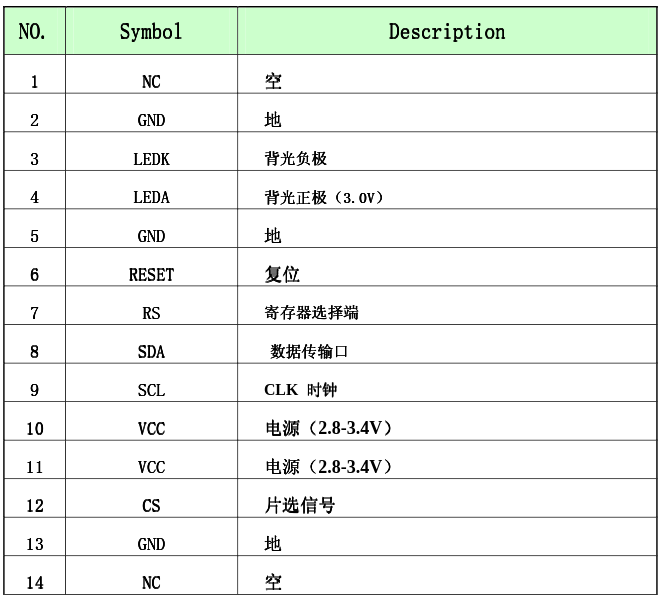

<http://uk.rs-online.com/web/p/oled-displays/0554314/>

<http://uk.farnell.com/midas/mct0144c6w128128pml/display-tft-lcd-1-44-transmissive/dp/2606862>

# lcd

[pickedlcd](https://www.adafruit.com/product/618)

## pinout

lcd pin number | name  | used
-------------- | ----- | ----
1              | NC    | no
2              | gnd   | no
3              | ledk  | no
4              | leda  | no
5              | gnd   | no
6              | reset | no
7              | rs    | no
8              | sda   | yes
9              | scl   | yes
10             | vcc   | no
11             | vcc   | yes
12             | cs    | no
13             | gnd   | yes
14             | NC    | no

# lcd maths

$$ { \frac {128} {86.05}} = 1.48 \text{ vertical degrees per pixel}$$

$$ { \frac {160} {98.8}} = 1.62 \text{ vertical degrees per pixel}$$
